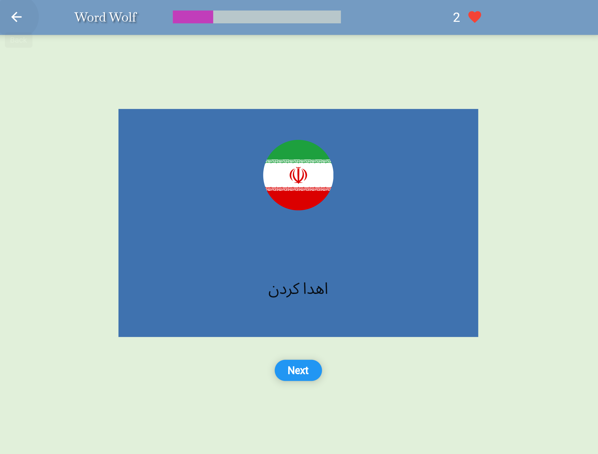
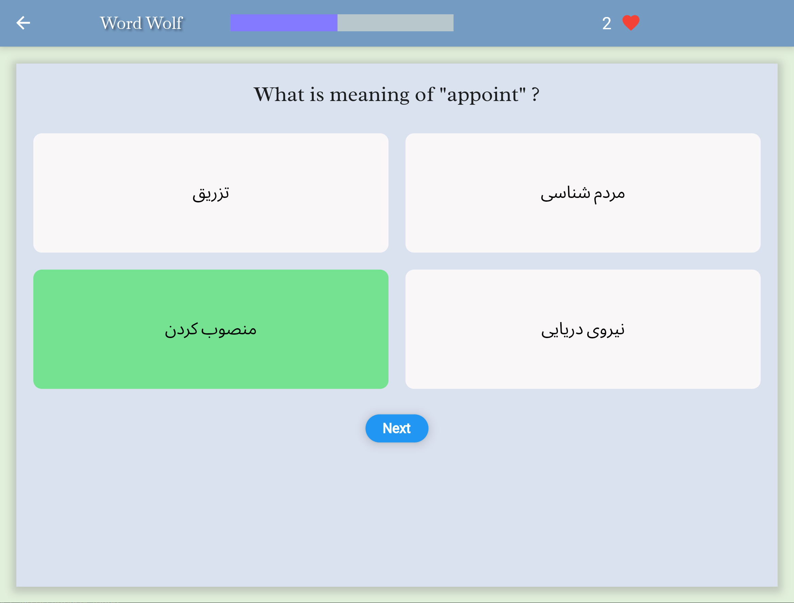

# Word Wolf: Learn & Conquer Languages

<div align="center">

</div>

# Introduction

Unleash your inner language warrior with Word Wolf! This engaging mobile application guides you on your quest to conquer new languages. Hunt down vocabulary with our fun and effective approach, whether you're a beginner or a seasoned learner. Word Wolf equips you with the tools you need to thrive in the wild world of language learning.

# Tech Stack
<div align="center">


</div>


- Flutter (Cross-platform Development)
- Spring Boot (Backend API)
- REST API (Communication between App and Backend)
- JWT (Secure User Authentication)
- SQLite (Database) (Optional: Replace with your database of choice)

# Installation

## Prerequisites
- Flutter SDK
- Dart SDK 
- JDK 17 or later
- Maven

## Frontend setup:
1. Clone the repository:
```shell
git clone https://github.com/seyed0123/word-wolf.git
cd word-wolf
```
2. Get Flutter dependencies:
```shell
flutter pub get
```
3. Run the Flutter application:
```shell
flutter run
```

## Backend setup:
1. Navigate to server dir
```shell
cd restAPi
```
2. Build and run the Spring Boot application:
```shell
mvn spring-boot:run
```

# Server Structure

<div align="center">

</div>

# Database Structure
<div align="center">

</div>

# Frontend

<div align="center">

## login


## sign up


## Home


## New word


## User word list


## Popular words


## Search word


## Setting


## Lesson
### Word reminding



### Questions



</div>

# Contributing
Contributions are welcome! Please feel free to submit a pull request.

# License
This project is licensed under the MIT License - see the LICENSE file for details.

